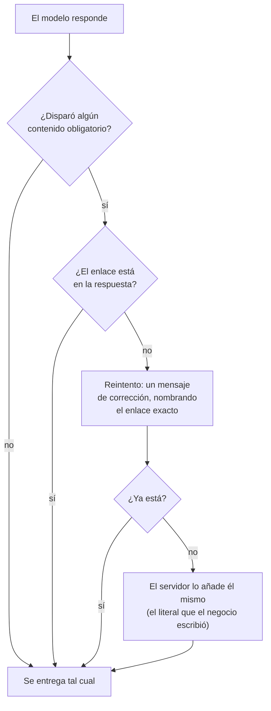

# Contenido obligatorio: verificado por código, no por confianza en el modelo

> **Dentro:** Por qué una regla en el prompt nunca llega a 0% · El diseño
> genérico (para todos, no para Lis) · El falso positivo que casi se
> despliega (Rappi) · La medición completa: 33% → 12,5% → **0%** · Cómo
> revertir
>
> ✅ **Implementado, probado con 19 pruebas unitarias y verificado con el
> pipeline real, 24-ago-2026.** Pendiente el despliegue de tres pasos —
> **este SÍ es código de aplicación**, a diferencia de los arreglos
> anteriores que solo tocaban datos.

## El porqué de este documento

En [124](124-EL-ASESOR-ENVIO-EL-ENLACE-QUE-EL-BOT-PROMETIO.md) se midió que
corregir la regla del catálogo de Lis bajó el fallo de 33% a 12,5% — pero no a
0%, porque **una regla en el prompt es texto, no código**: el modelo la lee y
decide si la sigue.

El dueño lo resumió así: *"necesito que el agente lea el CRM sí o sí… una
validación por estado para que el agente envíe el mensaje correcto antes de
entregarlo al cliente… no quiero una solución para un solo cliente, sino para
todos."*

Eso es lo que construye este documento: **un orquestador que verifica, por
código, que el contenido que el negocio configuró con un enlace llegue al
cliente cuando su mensaje coincide con el tema — sin depender de que el
modelo obedezca, y sin una sola palabra de "catálogo" ni de ningún sector en
el mecanismo.**

---

## El diseño

### Qué se protege, y qué no

Solo **enlaces**. No cualquier frase de la ficha o el conocimiento:

- Un enlace es un **literal verificable sin ambigüedad** — o está la URL
  exacta en la respuesta, o no está. Se puede comprobar por código.
- Una frase de tono ("sé cálida y cercana") o una prohibición ("nunca
  prometas tiempos exactos") **no tienen un literal que verificar**: forzarlas
  no tendría sentido, y no hay manera honesta de comprobarlas por código sin
  otra llamada al modelo — que sería no determinista igual que el problema
  que se está resolviendo.

### De dónde sale el disparador — sin un campo nuevo

El dueño, al decidir el alcance, fue claro: *"se supone que todo lo que el
cliente pone en el CRM es obligatorio"* — no quería una pantalla nueva para
marcar reglas como "especiales". Así que el mecanismo lee lo que **ya existe**:

- **`kb_entry` con una URL en la respuesta**: la `question` de la entrada ES el
  disparador — para eso existe ese campo, literalmente representa "cuándo
  el cliente quiere esto".
- **`reglasPropias` con una URL y un disparador condicional** ("SIEMPRE
  que…", "cuando…", "si el cliente…"): la cláusula antes de la acción es el
  disparador.

Sin campo nuevo, sin pantalla nueva. Cualquier negocio que ya tenga un enlace
en su conocimiento o en una regla queda protegido, sin código por cliente.

### Cómo se reconoce el disparador en el mensaje

Por **raíces de 4 letras**, no palabras exactas: la pregunta del negocio dice
*"¿para ver antes de **pedir**?"* y el cliente escribe *"quiero hacer un
**pedido**"* — palabras distintas, misma raíz (`pedi`). Es una heurística, no
gramática, y está documentada como tal en el código.

### La garantía, en tres pasos — el mismo patrón que ya usan los otros 6 guardarraíles

1. **El modelo genera su mejor respuesta.** No cambia nada aquí: sigue
   intentando.
2. Si el disparador coincidió con el mensaje del cliente y el enlace **no**
   está en la respuesta → **un reintento**, con el enlace exacto que falta
   nombrado en la corrección (nunca "algo").
3. Si tras el reintento **sigue** sin estar → **el servidor lo añade él
   mismo**, sin una tercera llamada al modelo. Es seguro hacerlo así porque lo
   único que se fuerza es un literal que **el propio negocio escribió** —
   nunca un dato inventado por el sistema.

---

## 🔴 El falso positivo que casi se despliega: Rappi

Al medir en vivo (no en teoría) apareció algo que ningún test unitario había
anticipado: **la regla de Rappi de Lis se disparaba con "quiero hacer un
pedido"**, sin que nadie preguntara por domicilios.

Causa: la regla de Rappi dice *"…este es el link para hacer tu **pedido**:
\<url\>"* — y la palabra *"pedido"* también vive en la regla del catálogo. Sin
distinguir de dónde saca sus palabras, cualquier mención de "pedido" disparaba
**las dos reglas a la vez**, metiendo el enlace de Rappi en cualquier mensaje
de compra.

La causa de fondo: la regla de Rappi es una **afirmación llana** ("tenemos
domicilios por Rappi, aquí el link"), no un disparador condicional — no dice
*"cuando pregunten por…"*. Sacar palabras clave de la frase entera, sin
distinguir eso, mezclaba vocabulario de dos reglas distintas.

**El arreglo**: una reglaPropia solo se usa como disparador si contiene un
marcador condicional explícito del español (*"siempre que", "cuando", "si el
cliente…"* — lenguaje, no vocabulario de negocio), y las palabras clave se
sacan **solo de la cláusula antes de la acción**, nunca de cómo ejecutarla.
Sin marcador, la regla queda **excluida por completo**: es más seguro no
proteger una regla ambigua que proteger la equivocada.

> Efecto secundario: la regla de Rappi de Lis, tal como está escrita hoy, **no
> queda protegida** por este mecanismo (no tiene disparador condicional). Es
> una limitación conocida, no un descuido — está en la tabla de pendientes.

---

## La medición completa

Con el pipeline real (`pnpm probar:citas` sobre conversaciones `is_test`,
nunca toca WhatsApp), la misma pregunta de Maricel, repetida:

| Momento | Corridas | Con enlace | Tasa de fallo |
|---|---|---|---|
| Antes de tocar nada | 6 | 4 | 33% |
| Tras separar la entrada de conocimiento | 8 | 6 | 25% |
| Tras corregir la regla en el CRM | 8 | 7 | 12,5% |
| **Con el guardarraíl de contenido obligatorio** | **8** | **8** | **0%** |

En 2 de las 8 corridas finales, el modelo **volvió a omitir el enlace** —el
fallo de fondo sigue existiendo, es del modelo, no se puede eliminar desde el
prompt— y las dos veces el cliente lo recibió igual, sin que nadie lo notara.

---

## Qué NO se hizo, a propósito

- **No se disparó con solo la promesa del modelo** (como el guardarraíl de
  "recurso prometido"): el disparador es lo que escribió **el cliente**, no lo
  que dijo el agente. Es justo el caso que ese guardarraíl no cubría — el
  modelo ni siquiera prometía nada, simplemente no lo mencionaba.
- **No se verificó con una llamada extra al modelo.** El disparador es
  determinista (raíces + coincidencia de texto); la única llamada extra es el
  reintento, que ya existe en los otros 6 guardarraíles.
- **No se protegió cualquier regla con URL**, solo las que tienen un
  disparador condicional explícito — por el caso de Rappi.

---

## Pruebas

19 pruebas unitarias en `tests/unit/contenido-obligatorio.test.ts`, con el
caso real de Maricel, el caso de Rappi (antes y después de tener un
disparador), y la mutación por cada tipo de acción (`reply`, `update_lead`,
`handoff`, `none`).

| | |
|---|---|
| typecheck · lint | limpio |
| Pruebas unitarias | **958**, 0 fallos (+18 de este cambio) |
| Verificado en vivo | 8/8 corridas con el enlace, contra Lis real (`is_test`) |

---

## ⚠️ Esto SÍ requiere desplegar

A diferencia de los arreglos anteriores de esta semana (que solo tocaban
`ficha`/`kb_entry`, datos en la base), **este cambio toca código de
aplicación**: `pipeline.ts`, `generar.ts`, `conducta.ts` y el módulo nuevo
`contenido-obligatorio.ts`. No tiene efecto hasta que:

1. Se empuje el commit.
2. `git archive` + `scp` + `tar` a la carpeta de EasyPanel (sin `.git`, no se
   entera de ningún push).
3. El dueño pulse Desplegar.
4. Se verifique DENTRO del contenedor.

---

## Cómo revertir

`git revert` del commit. No toca ningún dato: la regla del catálogo y las
entradas de conocimiento de Lis (arregladas en 120/124) se quedan como están,
independientemente de si este guardarraíl vive o no en el pipeline.
