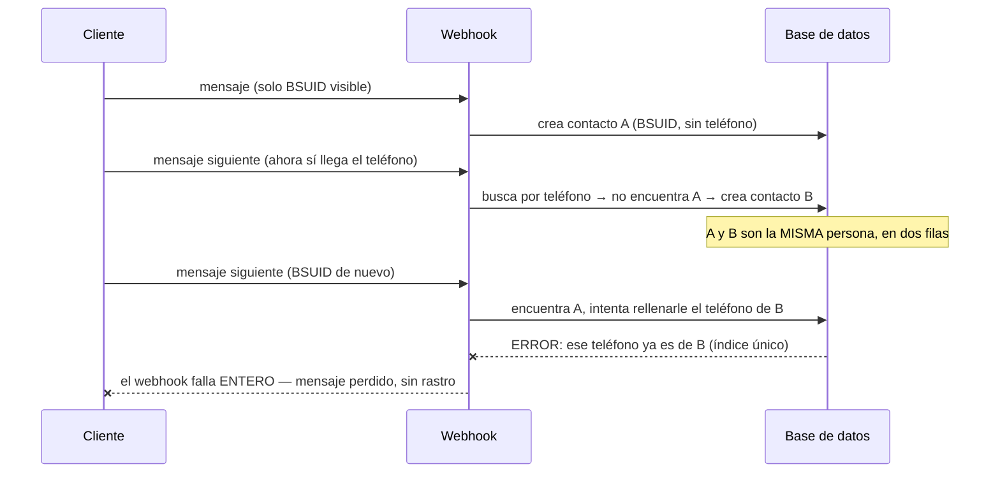

# El contacto duplicado que se tragaba mensajes: 87 webhooks fallidos en 18 días

> **Dentro:** El mecanismo exacto, encontrado en el código · La medición
> completa (44 mensajes reales perdidos) · El arreglo, con su prueba · La
> fusión de los 3 pares reales, con verificación de que no se perdió nada
>
> ✅ **Código arreglado y probado. Datos fusionados y verificados en
> producción, 24-ago-2026.** Pendiente el despliegue de tres pasos — es
> código de aplicación.

## El caso

Dos clientas de Lis escribieron y el bot no respondió — o respondió tarde, con
una plantilla que no tenía sentido. Auditando a fondo (no el primer síntoma
que explicara lo visto), una de las dos resultó ser un bug real y grave; la
otra, un asunto distinto y menor.

## El mecanismo

WhatsApp identifica a un cliente de dos formas: su **teléfono**, o su
**BSUID** (un identificador estable que usa cuando el cliente tiene activada
la privacidad de número). Lo normal es que ambas señales lleguen juntas, pero
no siempre — y cuando llegan por separado, `getOrCreateContact` tiene que
reconciliarlas: si ya existe un contacto con una señal y llega la otra, la
rellena con un `UPDATE`.

**Ese `UPDATE` no tenía manejo de conflicto.** Si la señal que "faltaba" ya
pertenecía a OTRO contacto —porque el mismo cliente ya se había guardado dos
veces, una por cada señal—, el `UPDATE` chocaba contra el índice único de la
base, la excepción no se capturaba, y **el webhook entero fallaba**. El
mensaje del cliente no llegaba a guardarse: ni una fila, ni un rastro.



## La medición, antes de tocar nada

87 eventos fallidos con este error exacto en Lis, del **6-ago al 24-ago**
(18 días):

| | |
|---|---|
| Tipo de evento | 44 `whatsapp.inbound_message.received` (mensajes reales) + 43 `whatsapp.smb.message.echoes` (ecos) |
| Clientas afectadas | al menos 3, identificadas con certeza (no heurística) desde los propios payloads fallidos |
| Otras organizaciones | 0 — exclusivo de Lis, por ser la que más usa la app nativa junto con la API |

Los 3 pares, extraídos literalmente de los eventos que fallaron (no
adivinados por cercanía en el tiempo — eso dio demasiado ruido en un primer
intento):

| Contacto A | Contacto B | Eventos fallidos |
|---|---|---|
| Nathalia (`CO.385…`) | 573103272262 | 4 |
| Tatis💙 (`CO.174…`) | 573156396765 | 44 |
| Alejandra Ramos (`CO.101…`) | 573194491215 | 37 |

Uno de estos casos es el de la captura que llegó al dueño: un pedido de un
día antes que se perdió, y cuando por fin un mensaje logró procesarse (ya
fuera de horario), el bot respondió con una plantilla que ignoraba el pedido
pendiente — porque ese pedido nunca se había guardado.

## El arreglo — a la raíz, no un parche

`src/server/inbox/ingest.ts`, `getOrCreateContact`. `buscarPorIdentidad` ya
trae **todos** los contactos que comparten cualquiera de las dos señales —
así que basta con no ofrecer como "falta por rellenar" nada que **otro**
candidato de esa misma búsqueda ya tenga:

```ts
const yaEsDeOtroContacto = (valor: string, campo: "phone" | "waUserId") =>
  candidatos.some((c) => c.id !== existing.id && c[campo] === valor);
```

Sin esto, `candidatos.length > 1` ya disparaba un aviso (*"MISMA PERSONA EN
DOS CONTACTOS… fusionar a mano"*) — el código sabía que el problema existía,
pero seguía intentando el `UPDATE` de todos modos. Ahora simplemente no lo
intenta si el valor colisionaría.

**No se añadió un `try/catch`.** Con esta comprobación, el `UPDATE` nunca
puede chocar por esta causa: es una prueba, no una mitigación probabilística.
Añadir una capa defensiva encima de algo ya demostrado imposible habría sido
redundancia, no profundidad.

### Prueba

`tests/unit/ingest-wa-username.test.ts` ya tenía el escenario exacto (dos
contactos para la misma persona); se le añadió la aserción que faltaba —
`expect(updated).toHaveLength(0)` — que habría fallado con el código
anterior (antes intentaba el `update` igual; el mock simplemente no simula un
índice único real, así que nunca lo había cazado).

## La fusión de los 3 pares reales

Con autorización explícita, y con un respaldo completo antes de tocar nada
(`contact_bk_fusion_20260824`, `conversation_bk_fusion_20260824`,
`message_bk_fusion_20260824`, `lead_bk_fusion_20260824` — 6 contactos, 6
conversaciones, 42 mensajes, 6 leads):

Por cada par:
1. Se movieron **todos** los mensajes de la conversación huérfana a la
   conversación canónica (la de más actividad, no siempre la más antigua).
2. El contacto canónico quedó con **las dos señales** (teléfono y BSUID).
3. La conversación huérfana, ya vacía, se borró.
4. El contacto huérfano se **archivó** (no se borró) y se le limpiaron sus
   señales — así queda reversible y no puede volver a colisionar.

| Par | Mensajes A | Mensajes B | Total tras fusionar |
|---|---|---|---|
| Nathalia / 573103272262 | 1 | 7 | **8** |
| Tatis💙 / 573156396765 | 7 | 7 | **14** |
| Alejandra Ramos / 573194491215 | 12 | 8 | **20** |

**Verificado que no se perdió ni un mensaje** (42 antes, 42 después) y que
la conversación fusionada se lee como una sola charla coherente en orden
cronológico — confirmado a ojo en el caso de Tatis: el hilo pasa de una firma
a la otra sin ningún salto raro, exactamente como si nunca se hubiera
partido.

Los `lead` (tarjetas del embudo) de ambos contactos de cada par ya estaban en
la **misma etapa** en los tres casos — no hubo que decidir cuál preferir. Se
dejaron sin tocar: el del contacto canónico sigue siendo el vigente, y el del
huérfano queda archivado junto con su contacto.

⚠️ **Lo que este arreglo NO evita**: si un cliente nuevo escribe primero con
una sola señal (solo BSUID o solo teléfono) y esa es toda la información que
WhatsApp manda en ese momento, seguirá naciendo un contacto con una sola
señal — eso no es un bug, es información incompleta que llega así. Lo que se
cerró es que, cuando llegue la segunda señal más tarde, **ya no puede tumbar
el webhook**: como mucho, se avisa (*"fusionar a mano"*) y el mensaje se
guarda igual.

## Pruebas

| | |
|---|---|
| typecheck · lint | limpio |
| Pruebas unitarias | **959**, 0 fallos |
| Verificado en producción | 3 pares fusionados, 0 mensajes perdidos, conversación coherente |

## ⚠️ Esto sí requiere desplegar

Código de aplicación (`ingest.ts`). La fusión de datos ya está aplicada y en
vivo — eso no requiere despliegue. El arreglo del código sí.

## Cómo revertir

**El código**: `git revert` del commit.

**La fusión de datos**, por par (ejemplo con Nathalia):
```sql
-- Restaurar los 3 contactos y las 3 conversaciones desde el respaldo:
-- contact_bk_fusion_20260824, conversation_bk_fusion_20260824
-- Los mensajes movidos: UPDATE message SET conversation_id = <original>
--   WHERE id IN (SELECT id FROM message_bk_fusion_20260824 WHERE conversation_id = <original>)
```
Las cuatro tablas de respaldo no tienen fecha de expiración — bórralas a mano
cuando ya no hagan falta.
