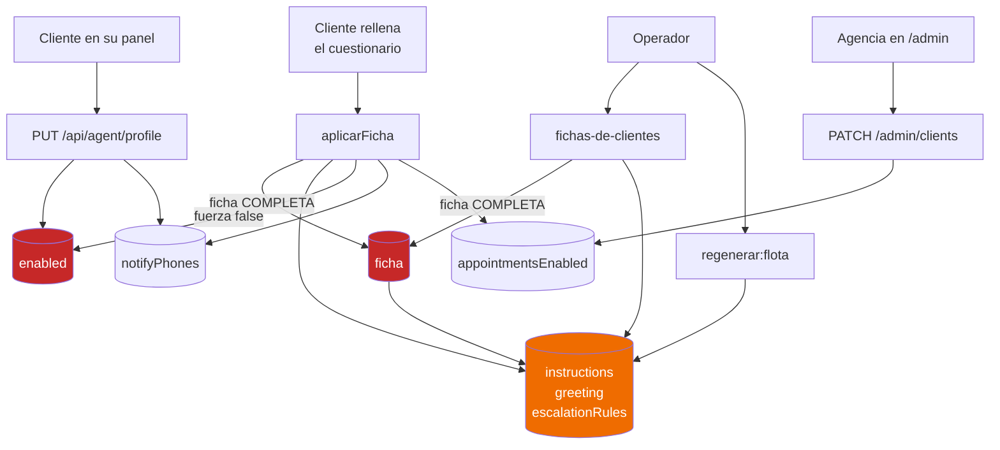
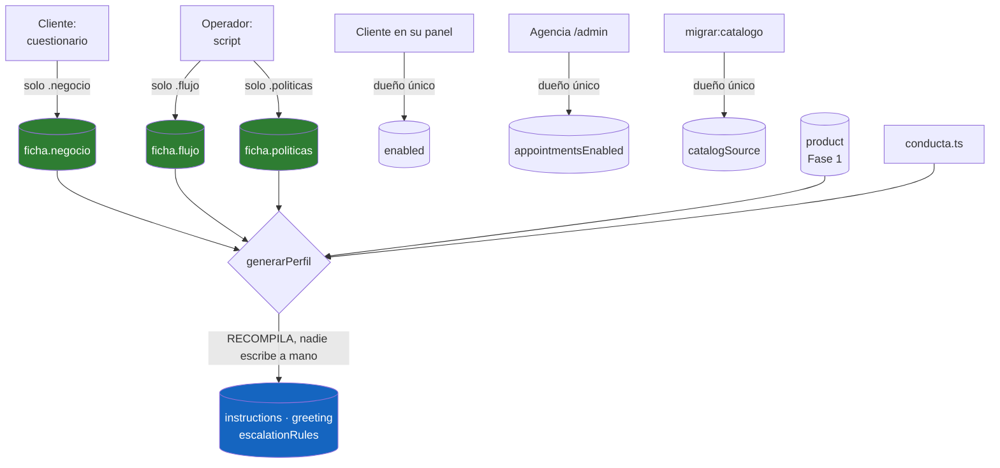

# Un dueño por dato: el prompt con dos escritores

> 🔑 **Esto no es un problema de arquitectura, es de propiedad de los datos.**
> Lo formuló el dueño, y conviene tenerlo delante al leer todo lo demás:
>
> | Trabajo | Pregunta que responde |
> |---|---|
> | Fase 1 | ¿Dónde vive el **catálogo**? |
> | Fase 2 | ¿Dónde vive el **estado**? |
> | **Este** | **¿Quién tiene permiso para modificar cada dato?** |
>
> Si esto no se resuelve primero, cualquier mejora futura puede desaparecer con
> una escritura silenciosa — que es exactamente lo que pasó el 15 de agosto.

## 🔴 Regla del proyecto

> **Está prohibido convertir clientes mientras exista un escritor capaz de
> reconstruir la ficha completa.**

> **Dentro:** Quién escribe hoy · Las cinco colisiones · Lo que nadie había
> dicho: fuente contra derivado · El flujo actual · El flujo propuesto · El plan
> de migración con rollback

**Encargo del dueño (15-ago-2026):** *"Antes de continuar con la Fase 2, quiero
resolver el problema del prompt con dos escritores. Quiero identificar al
propietario de cada dato y eliminar las escrituras concurrentes sobre la misma
información. No quiero parches."*

---

## Quién escribe `agent_profile` hoy

Nueve rutas, contando el alta y la demo:

| Campo | Cuestionario `aplicarFicha` | Script `fichas-de-clientes` | `regenerar:flota` | Panel del cliente `PUT /api/agent/profile` | `/admin` | `migrar:catalogo` |
|---|:---:|:---:|:---:|:---:|:---:|:---:|
| `ficha` | ✍️ | ✍️ | | | | |
| `instructions` | ✍️ | ✍️ | ✍️ | | | |
| `escalationRules` | ✍️ | ✍️ | ✍️ | | | |
| `greeting` | ✍️ | ✍️ | ✍️ | | | |
| `name` | ✍️ | ✍️ | ✍️ | | | |
| `tone` | ✍️ | | | | | |
| `hoursDays` · `hoursOpen/Close` (+domingo) | ✍️ | | | | | |
| `notifyPhones` | ✍️ (condicional) | | | ✍️ | | |
| `notifyTemplate` · `notifyTemplateLang` | | | | ✍️ | | |
| `enabled` | ✍️ (fuerza `false`) | | | ✍️ | | |
| `appointmentsEnabled` | ✍️ | | | | ✍️ | |
| `catalogSource` | | | | | | ✍️ |

(`provisioning.ts` hace el `INSERT` inicial; `seed/demo.ts` no toca producción.)

## Las cinco colisiones

| # | Campo | Escritores | Qué pasa cuando chocan |
|---|---|---|---|
| **1** | **`ficha`** | cuestionario + script | 🔴 **La que ya mordió.** El 15-ago a las 12:59 el prompt de La Churra pasó de 18.053 a 11.889 caracteres y perdió sus reglas de flujo |
| **2** | `instructions` · `greeting` · `escalationRules` · `name` | los tres | El último gana. Ninguno avisa |
| **3** | **`enabled`** | cuestionario + panel del cliente | 🔴 El cuestionario lo fuerza a `false`: **un cliente enciende su agente y al reenviar el cuestionario se apaga solo** |
| **4** | `notifyPhones` | cuestionario + panel | Mitigado el 15-ago (solo escribe si vienen teléfonos), pero los dos siguen pudiendo |
| **5** | `appointmentsEnabled` | cuestionario + `/admin` | El cuestionario lo deduce del vertical y pisa lo que puso la agencia |

## Lo que nadie había dicho: fuente contra derivado

Repartir propiedad campo por campo **no basta**, porque hay dos clases de datos
mezcladas en la misma tabla:

- **Fuente**: `ficha`, `enabled`, `notifyPhones`, `catalogSource`. Alguien los
  decide. Aquí sí falta un dueño único.
- **Derivado**: `instructions`, `greeting`, `escalationRules`, `name`. **Nadie
  los decide: se compilan** desde `ficha` + `conducta.ts`. Que tengan tres
  escritores no es el problema — el problema es que sean **editables**.

> 🔑 La colisión #2 no se arregla con un dueño. Se arregla dejando de tratar el
> resultado de una compilación como un dato que se puede escribir.

De ahí que la regla no sea *"un escritor por campo"* sino:

> **Cada dato tiene un dueño. Lo derivado no se escribe: se recompila.**

## El flujo actual



En rojo, los dos campos donde una escritura **borra en silencio** el trabajo de
la otra.

## El flujo propuesto

La `ficha` deja de ser un bloque único y pasa a **secciones con dueño**. Cada
escritor toca **solo su sección**, con `jsonb_set`, nunca reemplazando el
objeto entero:

```json
{
  "schema_version": 2,
  "negocio":   { "nombre": "…", "tono": "…", "horario": {}, "pagos": {}, "domicilios": {} },
  "flujo":     { "reglasPropias": [], "saludoInicial": "…" },
  "politicas": { "cancelacion": "…", "salud": "…" }
}
```

| Sección | Dueño único | Quién NO la toca |
|---|---|---|
| `negocio` | **el cliente**, por el cuestionario | el script |
| `flujo` | **el operador**, por script | el cuestionario |
| `politicas` | **el operador**, por script | el cuestionario |
| ~~`catalogo`~~ | **se elimina**: vive en `product` desde la Fase 1 | — |



Tres cambios más, pequeños y con consecuencia grande:

1. **El cuestionario deja de tocar `enabled`.** Encender y apagar es del
   cliente. Hoy reenviar el cuestionario apaga un agente que estaba vendiendo.
2. **`appointmentsEnabled` pasa a `/admin`**, que es quien contrata el vertical;
   el cuestionario deja de deducirlo.
3. **`generado_de` (hash de la ficha)**: si no coincide con la ficha actual, el
   prompt está viejo y se sabe **antes** de que alguien lo note en una
   conversación.

## El plan de migración, con rollback en cada paso

Aditivo, por cliente y reversible sin desplegar — como la Fase 1.

| Paso | Qué se hace | Rollback |
|---|---|---|
| **1** | Migración aditiva: `ficha_v2 jsonb` + `ficha_schema int` + `generado_de text`. **Nada las lee todavía** | `DROP COLUMN` (aún vacías) |
| **2** | Backfill: partir la `ficha` actual en las tres secciones, **por cliente y revisado a ojo**. `ficha` v1 intacta | no se ha tocado v1 |
| **3** | **Doble escritura**: cada escritor escribe su sección en v2 y sigue escribiendo v1 como hoy. Se lee de v1 | quitar la escritura de v2 |
| **4** | Comparar v1 contra lo que produciría v2 en toda la flota. **Solo se avanza si el prompt sale idéntico** | — |
| **5** | Voltear la lectura a v2 con `ficha_schema = 2`, **cliente por cliente**: primero el salón (apagado), luego La Churra, **Lis la última** | `UPDATE ficha_schema = 1`, sin desplegar |
| **6** | Semanas después: dejar de escribir v1 y borrar la columna | tras respaldo |

**Orden de clientes** (regla 9): salón → La Churra → Lis.

## Lo que este plan NO hace

- **No toca `conversation_state`** ni nada de la Fase 2: son problemas distintos.
- **No cambia el flujo conversacional** (regla 12).
- **No migra a Lis** hasta el final, y solo con la fase validada.
- **No arregla el hueco del catálogo** (recubierto y adiciones siguen fuera de
  `product`); eso es completar la Fase 1 y va aparte.

---

# Informe previo a la migración (15-ago-2026)

El dueño frenó la migración y pidió cerrar siete puntos antes de tocar la base.
**El resultado cambia el plan: ya no hacen falta columnas nuevas.**

## 1. Los tres campos nuevos, uno a uno — y los tres sobran

| Campo | ¿Qué resuelve? | Si no existiera… | Alternativa más simple | Veredicto |
|---|---|---|---|---|
| `ficha_v2` | Guardar la ficha por secciones sin romper la actual | Habría que reescribir `ficha` in situ | **`schema_version` DENTRO del JSON** y un lector que entienda las dos formas | ❌ **no hace falta** |
| `ficha_schema` | Saber qué forma tiene la ficha | No se sabría cuál es cuál | El JSON ya puede decirlo de sí mismo | ❌ **no hace falta** — y una columna aparte sería **el mismo dato en dos sitios**, justo lo que este trabajo viene a quitar |
| `generado_de` | Detectar que el prompt está viejo respecto a la ficha | No se detectaría el desfase | **Recompilar y comparar**: `pnpm simular:ficha` lo dice en 2 segundos, sobre la flota entera | ❌ **no hace falta**, y un hash puede quedarse viejo él mismo |

> 🔑 La simulación dejó sin argumento a `generado_de`: si el prompt **se puede
> recompilar idéntico cuando quieras**, no hace falta guardar una huella de
> cuándo se generó. Se pregunta y ya.

## 2. Riesgos de mantener `ficha` y `ficha_v2` a la vez

Se analizaron para decidir… y el análisis es lo que llevó a no crearla:

| Riesgo | Gravedad | Por qué |
|---|---|---|
| **Dos fuentes del mismo dato** | 🔴 alta | Es exactamente el problema que este documento arregla. Crear `ficha_v2` sería reproducirlo mientras dure la migración |
| Escritor que actualiza una y olvida la otra | 🔴 alta | Son 4 escritores × 2 columnas = 8 caminos que mantener sincronizados |
| Divergencia silenciosa | 🟠 media | Nadie se entera hasta que alguien regenera y sale un prompt distinto |
| Rollback ambiguo | 🟠 media | Con dos columnas vivas, "volver atrás" deja de tener una respuesta única |
| Coste de mantenimiento | 🟡 bajo | Código temporal que suele quedarse |

**Conclusión: la doble escritura sobra.** Con un lector que entienda las dos
formas, la conversión es un `UPDATE` por cliente, reversible desde el respaldo.

## 3. Simulación sobre la flota — **sin escribir nada**

`pnpm simular:ficha` (nuevo, solo lectura):

```
▸ La Churra    ficha: 15 campos → negocio 11 · flujo 2 · politicas 2
               ✅ ningún campo se pierde
               prompt: 17.355 guardado vs 17.355 recompilado → ✅ IDÉNTICO
▸ Lashes Valen ficha: 12 campos → negocio 9 · flujo 1 · politicas 2
               ✅ ningún campo se pierde
               prompt: 6.889 guardado vs 6.889 recompilado → ✅ IDÉNTICO

RESULTADO: 2 de 2 recompilan IDÉNTICO
Sin ficha (no migrables): Lis Pastelería, korex.ia
```

### El fallo que la simulación encontró antes de tocar nada

La **primera** corrida dio esto:

```
🔴 CAMPOS QUE SE PERDERÍAN: escalarSiempre, nuncaPrometer
   prompt: 17.355 guardado vs 16.978 recompilado → 🔴 DIFERENTE
```

Este documento había dado por vacía la sección `politicas`. **No lo estaba**:
ahí viven `escalarSiempre` y `nuncaPrometer` —las reglas de escalado y las
promesas prohibidas, incluidas las de salud—. Migrar sin simular habría borrado
en silencio justo las reglas que se ajustan a mano después de un incidente.

La sección `politicas` que pedía el dueño **era necesaria**, y la simulación lo
demostró con un número en vez de con una opinión.

## 4. Auditoría de escritores: **9 rutas, ni una más**

Confirmado por tres barridos: Drizzle (`update`/`insert`/`delete`), SQL crudo
sobre `agent_profile`, y `sql.unsafe`/`db.execute`. Los `db.execute` que existen
son de `rate-limit`, `cola` y `health`, sobre otras tablas. El único SQL crudo
que menciona `agent_profile` es el `CREATE TABLE … AS SELECT` del respaldo de
`regenerar:flota` — lectura.

## 5. Los dos fallos críticos: **corregidos**

`aplicarFicha` ya no escribe `enabled` ni `appointmentsEnabled`:

- **`enabled`**: es del cliente. Forzarlo a `false` apagaba un agente que estaba
  vendiendo cada vez que se reenviaba el cuestionario. No hace falta para que un
  alta nazca apagada: la columna ya tiene `default(false)`.
- **`appointmentsEnabled`**: es de la agencia, desde `/admin`, y ya lo escribe
  `provisioning.ts`. Ahora, si la ficha y lo contratado no coinciden, se
  **avisa** (`avisoDeVertical`) en vez de pisar.

## 6. ¿Funciona el sistema sin un prompt persistido?

**Sí.** Es lo que demuestra el punto 3: el prompt de los dos clientes con ficha
se recompila **carácter por carácter idéntico**. `instructions` deja de ser un
dato que custodiar y pasa a ser un artefacto reproducible — que es justo lo que
hace que perderlo deje de ser un incidente.

## 7. Recomendación final

**No ejecutar el paso 1 del plan original: ya no existe.** Sin `ficha_v2`, sin
`ficha_schema` y sin `generado_de`, **no hay migración de esquema que ejecutar**.

El plan queda en cuatro pasos, todos reversibles y ninguno con DDL:

| Paso | Qué | Rollback |
|---|---|---|
| **1** | Desplegar un **lector tolerante**: entiende la ficha plana (sin `schema_version`) y la de secciones. Nada cambia de comportamiento | desplegar el anterior |
| **2** | Cada escritor pasa a tocar **solo su sección** | ídem |
| **3** | Convertir la ficha **cliente por cliente** con respaldo previo, en el orden de siempre: salón → La Churra → **Lis nunca** (no tiene ficha) | restaurar del respaldo, sin desplegar |
| **4** | Semanas después, retirar el soporte de la forma plana | — |

**El orden importa**: primero el lector, después la conversión. Al revés, un
código viejo se encontraría una ficha que no sabe leer.

Y una nota sobre Lis: **no tiene ficha**, así que este trabajo no la toca. Su
prompt seguirá siendo manual hasta que se decida otra cosa.

## La pregunta de control (regla 14)

> ¿Esto reduce la dependencia del prompt de 18.000 caracteres?

**Sí.** Hoy el prompt es la única copia de verdad de las reglas de un negocio, y
por eso perderlo duele tanto. Con las secciones separadas, el prompt vuelve a
ser lo que debería: **un artefacto que se puede tirar y recompilar** desde
datos con dueño.
